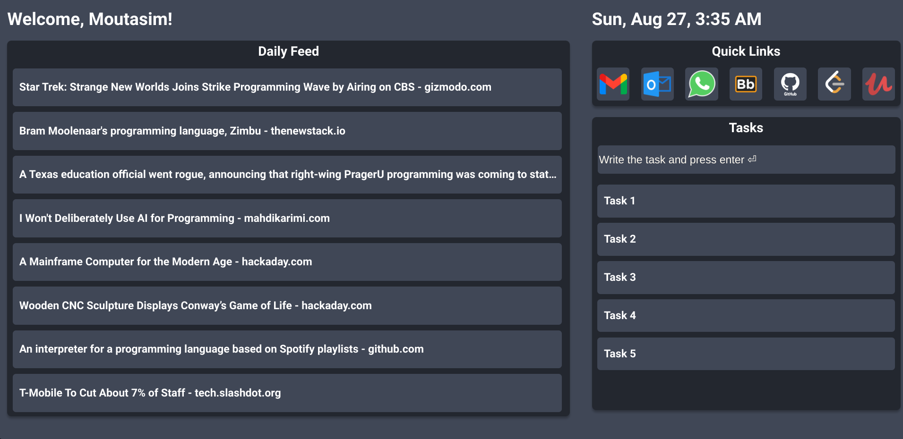

# Your Web Browser Homepage
A simple yet powerful homepage for your browser

## Progress Update
After each day of work, I will provide a screenshot of the completed work along with a changelog.

### Changelog

**Date: 27/08/2023**
- Fixed Quick links with fixed 7 links as my bookmark, I know I should have done the custom links feature but I decided to make it easier
- Fixed responsiveness for different screens like mobile devices
- Changed the color of titles background
- Refactored the CSS file for reduced cluttering and higher re-usability
- Fixed Date and Time auto refresh not working

**Date: 24/08/2023**
- Added automatic news to the feeds using NewsAPI

**Date: 21/08/2023**
- Updated the Daily feed to display fixed static news using React props.

**Date: 19/08/2023**
- Continued building the components and used static elements.

**Date: 17/08/2023**
- Added the main blocks of the app and layout using flexbox.

**Date: 16/08/2023**
- Finished the design using Figma.

## Guided Commands

### `npm start`

Runs the app in development mode.\
Open [http://localhost:3000](http://localhost:3000) to view it in your browser.

The page will reload when you make changes.\
You may also see any lint errors in the console.

### `npm test`

Launches the test runner in interactive watch mode.\
See the section about [running tests](https://facebook.github.io/create-react-app/docs/running-tests) for more information.

### `npm run build`

Builds the app for production to the `build` folder.\
It correctly bundles React in production mode and optimizes the build for the best performance.

The build is minified and the filenames include the hashes.\
Your app is ready to be deployed!

See the section about [deployment](https://facebook.github.io/create-react-app/docs/deployment) for more information.

## Deployment

For deployment instructions, please refer to the official [Create React App Deployment Documentation](https://facebook.github.io/create-react-app/docs/deployment).