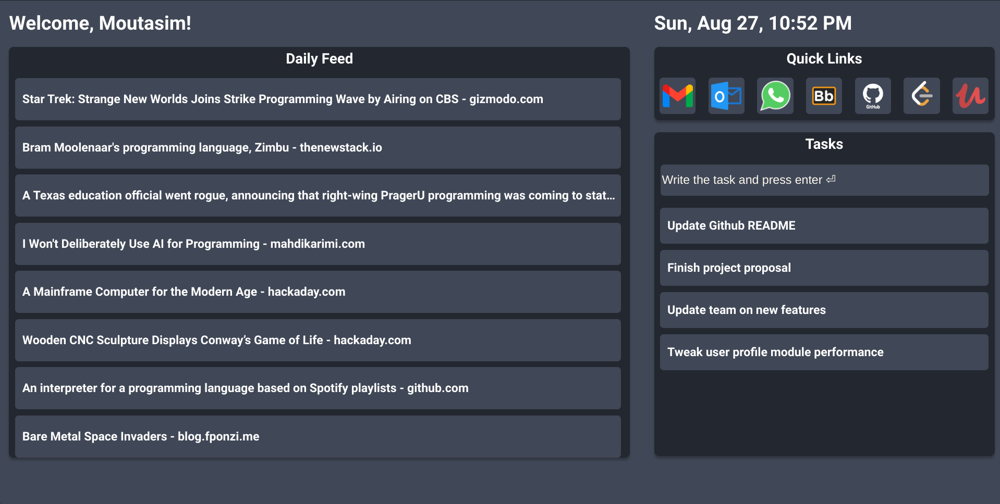

# Your web browser homepage
A simple yet powerful homepage for your browser

## Progress Update:
After each daily work I paste a screenshot of the done work + some changelog

### Changelog:

Date: 19/ 08/ 2023
- Updated the Daily feed to get fixed static news using react props

Date: 19/ 08/ 2023
- Continued making the components and used static elements

Date: 17/ 08/ 2023
- Added the main blocks of the app and layout using flexbox  

Date: 16/ 08/ 2023
- Finished Design via Figma

# Guided commands

### `npm start`

Runs the app in the development mode.\
Open [http://localhost:3000](http://localhost:3000) to view it in your browser.

The page will reload when you make changes.\
You may also see any lint errors in the console.

### `npm test`

Launches the test runner in the interactive watch mode.\
See the section about [running tests](https://facebook.github.io/create-react-app/docs/running-tests) for more information.

### `npm run build`

Builds the app for production to the `build` folder.\
It correctly bundles React in production mode and optimizes the build for the best performance.

The build is minified and the filenames include the hashes.\
Your app is ready to be deployed!

See the section about [deployment](https://facebook.github.io/create-react-app/docs/deployment) for more information.

### Deployment

Go to: [https://facebook.github.io/create-react-app/docs/deployment](https://facebook.github.io/create-react-app/docs/deployment)
